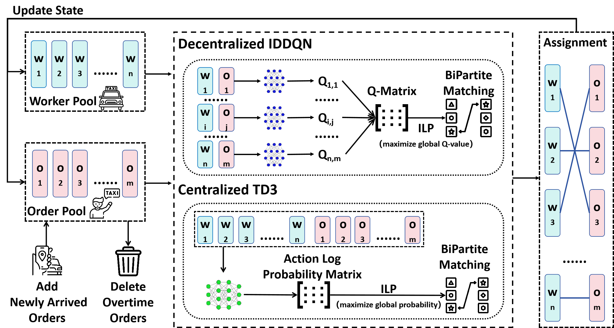

# Triple-BERT

**Article:** "Triple-BERT: Do We Really Need MARL for Order Dispatch on Ride-Sharing Platforms?" (under review)


## 1. Workflow




## 2. Dataset

The dataset used in this study is derived from the [yellow taxi data in Manhattan](https://www.nyc.gov/site/tlc/about/tlc-trip-record-data.page). The processed data can be found in the `./data` directory.


## 3. How to Run

### 3.1 Stage 1: IDDQN

To run Stage 1, execute the following command in the `./pretrain` directory:

```shell
python train.py --bi_direction 
```


### 3.2 Stage 2: TD3

To run Stage 2, execute the following command in the `./finetune` directory:

```shell
python train.py --bi_direction --pretrain_model_path <path_to_trained_model_from_stage_1>
```


## 4. Model Parameters

The model parameters and training log files for both Stage 1 and Stage 2 are located in the `./parameters` directory.


## 5. Reference

```

```

