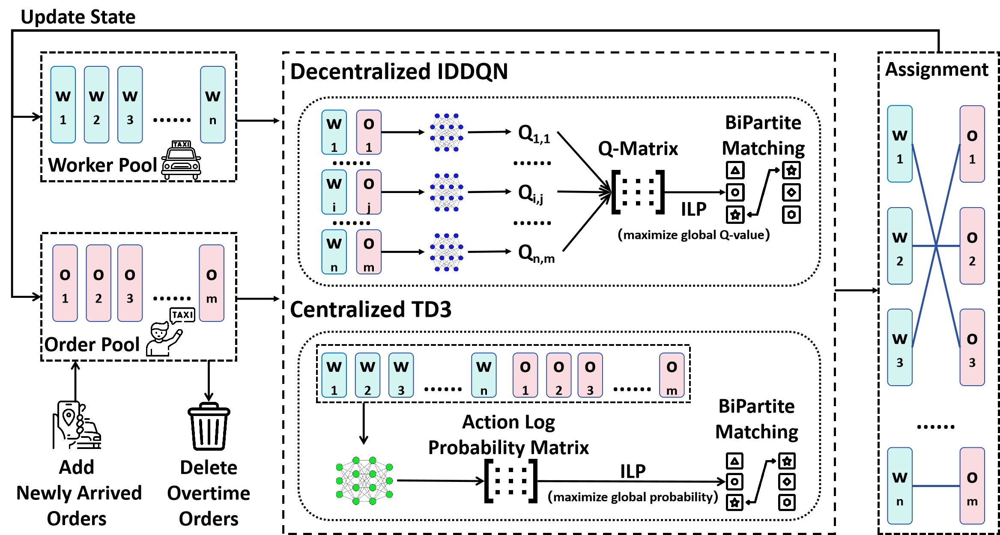
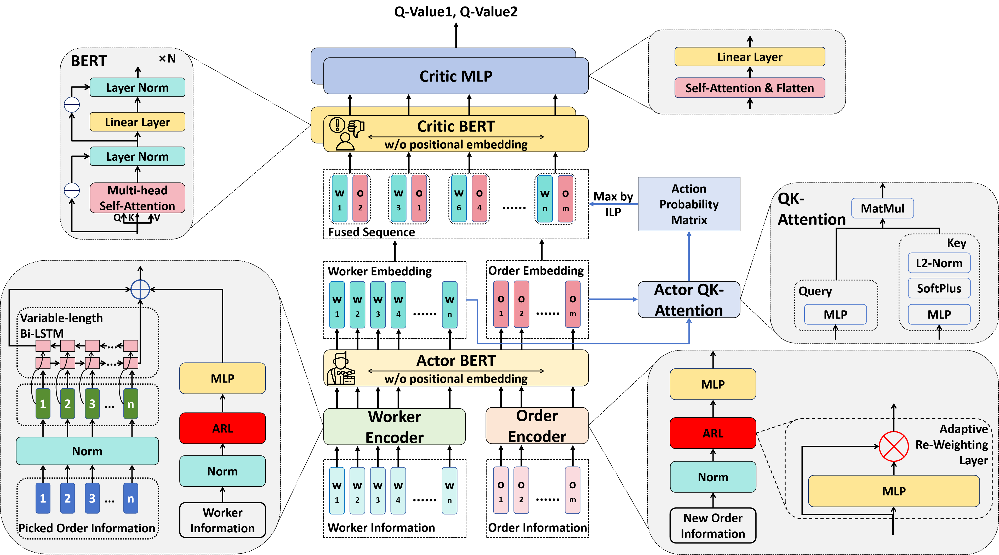

# Triple-BERT

**Article:** Zijian Zhao, Sen Li*, "[Triple-BERT: Do We Really Need MARL for Order Dispatch on Ride-Sharing Platforms?](https://openreview.net/forum?id=symgW6FhA6&referrer=[Author Console](%2Fgroup%3Fid%3DICLR.cc%2F2026%2FConference%2FAuthors%23your-submissions))", 2026 International Conference on Learning Representations (ICLR), 2026


## 1. Workflow







## 2. Dataset

The dataset used in this study is derived from the [yellow taxi data in Manhattan](https://www.nyc.gov/site/tlc/about/tlc-trip-record-data.page). 

~~The processed data can be found in the `./data` directory.~~

Considering the copyright, we have removed the processed data. However, the data processing code is available in the `./data` directory. Please download the dataset from the link provided above and use our code to process it.


## 3. How to Run

### 3.1 Stage 1: IDDQN

To run Stage 1, execute the following command in the `./pretrain` directory:

```shell
python train.py --bi_direction 
```


### 3.2 Stage 2: TD3

To run Stage 2, execute the following command in the `./finetune` directory:

```shell
python train.py --bi_direction --pretrain_model_path <path_to_trained_model_from_stage_1>
```


## 4. Model Parameters

The model parameters and training log files for both Stage 1 and Stage 2 are located in the `./parameters` directory.


## 5. Reference

```
@article{zhao2025triple,
  title={Triple-BERT: Do We Really Need MARL for Order Dispatch on Ride-Sharing Platforms?},
  author={Zhao, Zijian and Li, Sen},
  journal={arXiv preprint arXiv:2510.03257},
  year={2025}
}
```

